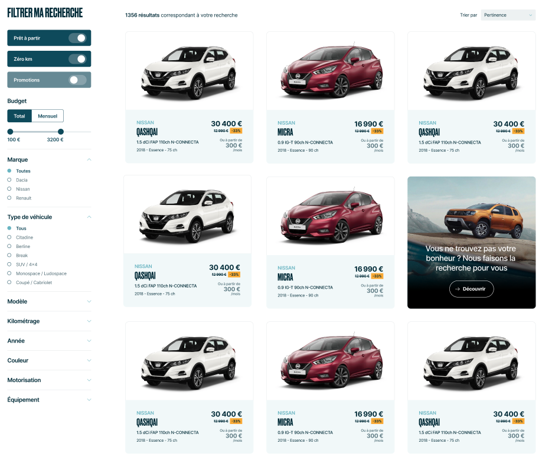

# Nuxt.js 4Tech Test

Look at the [design on adobe XD.](https://xd.adobe.com/view/b65f84ac-efe6-4c0c-9593-cc996d93ea5b-e30c/).



## Setup

Make sure to install the dependencies:

```bash

npm install

```

## Development Server

Start the development server on `http://localhost:3000`:

```bash

npm run dev

```

## Production

Build the application for production:

```bash

npm run build

```

Locally preview production build:

```bash

npm run preview

```

Check out the [deployment documentation](https://nuxt.com/docs/getting-started/deployment) for more information.
